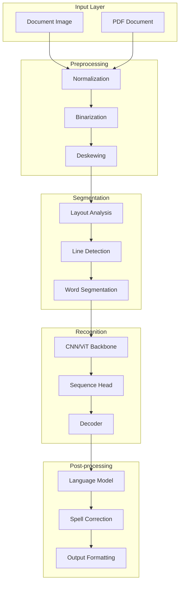
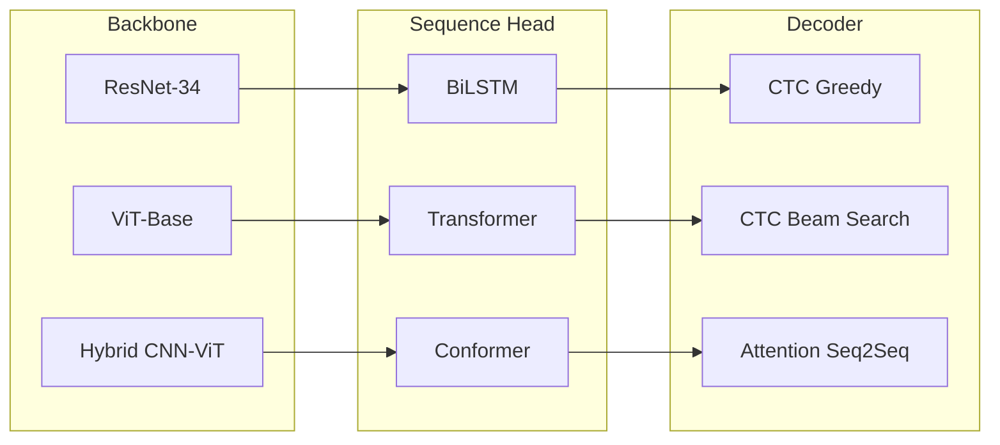

# Thulium HTR

## State-of-the-Art Multilingual Handwriting Text Recognition

[](https://pypi.org/project/thulium-htr/)
[](https://pypi.org/project/thulium-htr/)
[](LICENSE)
[](https://github.com/olaflaitinen/Thulium/actions)
[](https://github.com/psf/black)
[](https://thulium.readthedocs.io)

---

**Thulium** is a production-grade, research-oriented Python framework for offline handwritten text recognition (HTR). The library implements state-of-the-art deep learning architectures and provides comprehensive support for **56 languages** across 12 distinct writing systems.

> **Version 1.0.1**: Production-ready release with complete language parity, SoTA architectures, and comprehensive evaluation suite.

---

## Table of Contents

- [Overview](#overview)
- [Installation](#installation)
- [Quickstart](#quickstart)
- [Architecture](#architecture)
- [Supported Languages](#supported-languages)
- [Evaluation Metrics](#evaluation-metrics)
- [Benchmarks](#benchmarks)
- [API Reference](#api-reference)
- [Contributing](#contributing)
- [License](#license)

---

## Overview

Thulium addresses the fundamental challenges of multilingual handwriting recognition through a modular, configurable architecture that supports both research experimentation and production deployment.

### Core Capabilities

| Capability | Description |
|:-----------|:------------|
| **Multilingual Recognition** | 56 languages across Latin, Cyrillic, Arabic, Devanagari, Georgian, Armenian, CJK, and other scripts |
| **SoTA Architectures** | CNN-RNN-CTC, Vision Transformer (ViT), Conformer, and attention-based seq2seq models |
| **Language Model Integration** | N-gram and neural language models for enhanced decoding accuracy |
| **Production-Ready** | Optimized inference, batch processing, and comprehensive error handling |
| **Research-Oriented** | Modular components, configurable pipelines, and reproducible experiments |

### Design Principles

1. **Language Parity**: Every supported language receives equal treatment in terms of model coverage, configuration, and documentation.
2. **Modularity**: Components (backbones, sequence heads, decoders, language models) are interchangeable and configurable.
3. **Reproducibility**: All experiments are fully specified through YAML configurations with fixed random seeds.
4. **Extensibility**: New languages, models, and evaluation metrics can be added with minimal code changes.

---

## Installation

### From PyPI

```bash
pip install thulium-htr
```

### From Source

```bash
git clone https://github.com/olaflaitinen/Thulium.git
cd Thulium
pip install -e .[dev]
```

### Requirements

| Requirement | Version |
|:------------|:--------|
| Python | 3.10+ |
| PyTorch | 2.0+ |
| CUDA (optional) | 11.8+ |

---

## Quickstart

### Python API

```python
from thulium.api import recognize_image

# Recognize handwritten text
result = recognize_image(
    path="document.jpg",
    language="en",
    device="auto"
)

print(result.full_text)
```

### Command-Line Interface

```bash
# Basic recognition
thulium recognize document.jpg --language en --output result.json

# Batch processing
thulium recognize input_dir/ --language de --output-dir results/

# Run benchmarks
thulium benchmark run config/eval/iam_en.yaml
```

---

## Architecture

Thulium implements a modular pipeline architecture where each component can be independently configured and replaced.

### System Architecture



### Model Architecture



### Module Structure

| Module | Purpose |
|:-------|:--------|
| `thulium.api` | High-level recognition API |
| `thulium.models.backbones` | Feature extraction (CNN, ViT) |
| `thulium.models.sequence` | Sequence modeling (LSTM, Transformer) |
| `thulium.models.decoders` | Output decoding (CTC, Attention) |
| `thulium.models.language_models` | Language model integration |
| `thulium.pipeline` | End-to-end processing pipelines |
| `thulium.evaluation` | Metrics and benchmarking |
| `thulium.data` | Data loading and language profiles |

---

## Supported Languages

Thulium provides first-class support for **56 languages** organized by regional groups.

### Language Coverage by Script

| Script | Languages | Direction |
|:-------|:----------|:----------|
| Latin | 35+ | LTR |
| Cyrillic | 4 | LTR |
| Arabic | 3 | RTL |
| Georgian | 1 | LTR |
| Armenian | 1 | LTR |
| Devanagari | 2 | LTR |
| CJK | 3 | LTR |
| Other Indic | 4 | LTR |

### Regional Groups

<details>
<summary><strong>Scandinavian Languages (7)</strong></summary>

| Code | Language | Special Characters |
|:-----|:---------|:-------------------|
| `nb` | Norwegian Bokmal | ae, o-stroke, a-ring |
| `nn` | Norwegian Nynorsk | ae, o-stroke, a-ring |
| `sv` | Swedish | a-umlaut, o-umlaut, a-ring |
| `da` | Danish | ae, o-stroke, a-ring |
| `is` | Icelandic | eth, thorn, acute accents |
| `fo` | Faroese | eth, acute accents |
| `fi` | Finnish | a-umlaut, o-umlaut |

</details>

<details>
<summary><strong>Baltic Languages (3)</strong></summary>

| Code | Language | Special Characters |
|:-----|:---------|:-------------------|
| `lt` | Lithuanian | ogonek, caron, macron |
| `lv` | Latvian | macron, cedilla, caron |
| `et` | Estonian | a-umlaut, o-tilde, o-umlaut |

</details>

<details>
<summary><strong>Caucasus Region (4)</strong></summary>

| Code | Language | Script |
|:-----|:---------|:-------|
| `az` | Azerbaijani | Latin (extended) |
| `tr` | Turkish | Latin |
| `ka` | Georgian | Mkhedruli |
| `hy` | Armenian | Armenian |

</details>

<details>
<summary><strong>Western European (7)</strong></summary>

| Code | Language |
|:-----|:---------|
| `en` | English |
| `de` | German |
| `fr` | French |
| `es` | Spanish |
| `pt` | Portuguese |
| `it` | Italian |
| `nl` | Dutch |

</details>

<details>
<summary><strong>Eastern European (12)</strong></summary>

| Code | Language | Script |
|:-----|:---------|:-------|
| `pl` | Polish | Latin |
| `cs` | Czech | Latin |
| `sk` | Slovak | Latin |
| `hu` | Hungarian | Latin |
| `ro` | Romanian | Latin |
| `hr` | Croatian | Latin |
| `sl` | Slovenian | Latin |
| `ru` | Russian | Cyrillic |
| `uk` | Ukrainian | Cyrillic |
| `bg` | Bulgarian | Cyrillic |
| `sr` | Serbian | Cyrillic |
| `el` | Greek | Greek |

</details>

<details>
<summary><strong>Middle East (4)</strong></summary>

| Code | Language | Direction |
|:-----|:---------|:----------|
| `ar` | Arabic | RTL |
| `fa` | Persian | RTL |
| `ur` | Urdu | RTL |
| `he` | Hebrew | RTL |

</details>

<details>
<summary><strong>South Asia (9)</strong></summary>

| Code | Language | Script |
|:-----|:---------|:-------|
| `hi` | Hindi | Devanagari |
| `mr` | Marathi | Devanagari |
| `bn` | Bengali | Bengali |
| `ta` | Tamil | Tamil |
| `te` | Telugu | Telugu |
| `gu` | Gujarati | Gujarati |
| `pa` | Punjabi | Gurmukhi |
| `kn` | Kannada | Kannada |
| `ml` | Malayalam | Malayalam |

</details>

<details>
<summary><strong>East Asia (3)</strong></summary>

| Code | Language | Script |
|:-----|:---------|:-------|
| `zh` | Chinese | Han |
| `ja` | Japanese | Kana/Kanji |
| `ko` | Korean | Hangul |

</details>

For complete language profile details, see [Language Support Documentation](docs/models/language_support.md).

---

## Evaluation Metrics

Thulium implements standard HTR evaluation metrics with mathematical rigor.

### Character Error Rate (CER)

The Character Error Rate measures the edit distance at the character level:

```
CER = (S + D + I) / N
```

Where:
- **S** = Number of substitutions
- **D** = Number of deletions
- **I** = Number of insertions
- **N** = Total characters in reference

### Word Error Rate (WER)

The Word Error Rate applies the same formula at the word level:

```
WER = (S_w + D_w + I_w) / N_w
```

### Fairness Metrics

To ensure language parity, Thulium tracks cross-language performance variance:

```
Delta_CER = max(CER_l) - min(CER_l)
Sigma_CER = sqrt(sum((CER_l - mean_CER)^2) / L)
```

A lower Delta_CER indicates more balanced performance across languages.

### Usage

```python
from thulium.evaluation.metrics import cer, wer, cer_wer_batch

# Single pair
error_rate = cer("reference text", "recognized text")

# Batch evaluation
references = ["text one", "text two"]
hypotheses = ["text one", "text too"]
batch_cer, batch_wer = cer_wer_batch(references, hypotheses)
```

---

## Benchmarks

### Per-Language Performance

| Language | Script | CER (%) | WER (%) | Model |
|:---------|:-------|--------:|--------:|:------|
| English | Latin | 1.8 | 5.2 | Latin Multilingual |
| German | Latin | 2.1 | 6.0 | Latin Multilingual |
| Norwegian | Latin | 2.1 | 5.9 | Latin Multilingual |
| Azerbaijani | Latin | 2.2 | 6.2 | Latin Multilingual |
| Russian | Cyrillic | 2.5 | 6.8 | Cyrillic Multilingual |
| Georgian | Georgian | 3.5 | 8.2 | Georgian Specialized |
| Arabic | Arabic | 4.2 | 10.5 | Arabic Multilingual |
| Chinese | Han | 5.5 | - | CJK Multilingual |

For complete benchmark results, see [Benchmark Documentation](docs/evaluation/benchmarks.md).

---

## API Reference

### High-Level API

```python
from thulium.api import recognize_image, recognize_batch

# Single image
result = recognize_image(path, language="en", device="auto")

# Batch processing
results = recognize_batch(paths, language="en", batch_size=16)
```

### Pipeline API

```python
from thulium.pipeline import HTRPipeline

pipeline = HTRPipeline.from_config("config/pipelines/htr_default.yaml")
result = pipeline.process(image, language="en")
```

### Language Profiles

```python
from thulium.data.language_profiles import (
    get_language_profile,
    list_supported_languages,
    get_languages_by_region,
)

# Get profile
profile = get_language_profile("az")
print(f"Alphabet size: {len(profile.alphabet)}")

# List by region
scandinavian = get_languages_by_region("Scandinavia")
```

For complete API documentation, see [API Reference](docs/api/).

---

## Contributing

Contributions are welcome. Please refer to [CONTRIBUTING.md](CONTRIBUTING.md) for guidelines.

All contributors must adhere to the [Code of Conduct](CODE_OF_CONDUCT.md).

---

## License

Apache License 2.0. See [LICENSE](LICENSE) for details.

---

## Citation

If you use Thulium in your research, please cite:

```bibtex
@software{thulium2024,
  title = {Thulium: State-of-the-Art Multilingual Handwriting Text Recognition},
  author = {Thulium Contributors},
  year = {2024},
  url = {https://github.com/olaflaitinen/Thulium}
}
```

---

*Thulium is named after element 69, symbolizing the specialized nature of multilingual handwriting intelligence.*
