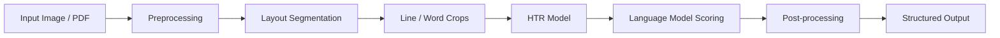

# Thulium - Multilingual Handwriting Intelligence for Python

[](https://github.com/olaflaitinen/Thulium/actions)
[](https://codecov.io/gh/olaflaitinen/Thulium)
[](https://pypi.org/project/thulium/)
[](https://pypi.org/project/thulium/)
[](LICENSE)
[](https://github.com/psf/black)
[](https://github.com/astral-sh/ruff)
[](http://mypy-lang.org/)
[](https://pre-commit.com/)
[](https://thulium.readthedocs.io)

---

**Thulium** is a state-of-the-art, open-source Python library for offline handwritten text recognition (HTR) and document intelligence. Engineered for high-performance research and production deployments, Thulium provides an end-to-end processing stack from document layout analysis to language-model-enhanced decoding across **50+ languages**, with comprehensive support for Latin, Cyrillic, Arabic, Devanagari, and other major world scripts.

> **Note**: Thulium is currently in alpha status. APIs are subject to change prior to the 1.0 release.

## Overview

Thulium abstracts the complexity of modern deep learning-based OCR/HTR pipelines into a modular, extensible Python API. The library is designed to address the challenges of multilingual handwriting recognition, providing robust solutions for digitizing historical archives, processing structured forms, and building reading systems for both high-resource and low-resource languages.

The architecture emphasizes configurability and research reproducibility, enabling researchers and engineers to experiment with different model components while maintaining production-grade reliability.

### Key Capabilities

- **Multilingual Deep Learning**: Pluggable language profiles supporting 50+ languages across Latin, Cyrillic, Arabic, Devanagari, Georgian, Armenian, and other scripts.
- **End-to-End Pipeline**: Complete processing chain including:
  - **Preprocessing**: Image normalization, binarization, and augmentation.
  - **Segmentation**: Robust line and word segmentation via U-Net architectures.
  - **Recognition**: CNN-RNN-CTC and Transformer-based HTR models.
  - **Decoding**: Greedy, beam search, and language-model-enhanced decoding.
- **Production-Ready Design**: Built with modularity, extensibility, and rigorous testing practices.
- **Explainability (XAI)**: Built-in tools for attention visualization and confidence analysis.
- **Comprehensive CLI**: Command-line interface for batch processing and evaluation.

## Installation

### From PyPI (Coming Soon)

```bash
pip install thulium
```

### From Source (Development)

```bash
git clone https://github.com/olaflaitinen/Thulium.git
cd Thulium
pip install -e .[dev]
```

### System Requirements

- Python 3.10 or higher
- PyTorch 2.0 or higher
- Optional: CUDA-compatible GPU for accelerated inference
- Optional: `poppler-utils` for PDF processing

## Quickstart

### Python API

The high-level API automates model selection and pipeline orchestration.

```python
from thulium.api import recognize_image

# Recognize text in an Azerbaijani document
result = recognize_image(
    path="docs/samples/handwriting.jpg",
    language="az",
    device="auto"  # Automatically uses GPU if available
)

print(f"Full Text:\n{result.full_text}")

# Inspect confidence per line
for line in result.lines:
    if line.confidence < 0.8:
        print(f"Low confidence line [{line.confidence:.2f}]: {line.text}")
```

### CLI Usage

Thulium includes a robust command-line interface for batch processing and evaluation.

```bash
# Basic recognition
thulium recognize my_document.jpg --language az --output result.json

# Verbose logging
thulium recognize page_01.png -l en -v

# Show version
thulium version
```

## Architecture Overview

Thulium is organized into modular, composable layers to facilitate research and extension:



| Module | Description |
| :--- | :--- |
| `thulium.api` | High-level entry points for ease of use. |
| `thulium.data` | Loaders, transforms, and language profile registry. |
| `thulium.models` | PyTorch implementations of backbones, sequence heads, and decoders. |
| `thulium.pipeline` | Logic for chaining segmentation and recognition steps. |
| `thulium.evaluation` | Metrics (CER, WER, SER) and benchmarking tools. |
| `thulium.xai` | Explainability via attention maps and confidence analysis. |

For a detailed technical description, see the [Architecture Documentation](docs/architecture.md).

## Language Support

Thulium is architected to support **50+ languages** across diverse writing systems. Language support is defined via modular **Language Profiles** in `thulium.data.language_profiles`.

### Scandinavian Languages

| Code | Language | Script | Notes |
| :--- | :--- | :--- | :--- |
| `nb` | Norwegian (Bokmal) | Latin | Standard written Norwegian |
| `nn` | Norwegian (Nynorsk) | Latin | New Norwegian variant |
| `sv` | Swedish | Latin | |
| `da` | Danish | Latin | |
| `is` | Icelandic | Latin | Preserves Old Norse characters |
| `fo` | Faroese | Latin | |
| `fi` | Finnish | Latin | Finno-Ugric language |

### Baltic Languages

| Code | Language | Script | Notes |
| :--- | :--- | :--- | :--- |
| `lt` | Lithuanian | Latin | |
| `lv` | Latvian | Latin | |
| `et` | Estonian | Latin | Finno-Ugric language |

### Caucasus Region

| Code | Language | Script | Notes |
| :--- | :--- | :--- | :--- |
| `az` | Azerbaijani | Latin | Extended alphabet with special characters |
| `tr` | Turkish | Latin | Dotted/dotless i distinction |
| `ka` | Georgian | Georgian | Mkhedruli script |
| `hy` | Armenian | Armenian | Eastern Armenian alphabet |

### Western Europe

| Code | Language | Script | Notes |
| :--- | :--- | :--- | :--- |
| `en` | English | Latin | Baseline model and configs |
| `de` | German | Latin | |
| `fr` | French | Latin | Full accent support |
| `es` | Spanish | Latin | |
| `pt` | Portuguese | Latin | |
| `it` | Italian | Latin | |
| `nl` | Dutch | Latin | |

### Eastern Europe

| Code | Language | Script | Notes |
| :--- | :--- | :--- | :--- |
| `pl` | Polish | Latin | |
| `cs` | Czech | Latin | |
| `sk` | Slovak | Latin | |
| `hu` | Hungarian | Latin | |
| `ro` | Romanian | Latin | |
| `bg` | Bulgarian | Cyrillic | |
| `sr` | Serbian (Cyrillic) | Cyrillic | Also supports Latin variant |
| `hr` | Croatian | Latin | |
| `sl` | Slovenian | Latin | |
| `ru` | Russian | Cyrillic | |
| `uk` | Ukrainian | Cyrillic | |
| `el` | Greek | Greek | |

### Middle East and Central Asia

| Code | Language | Script | Direction | Notes |
| :--- | :--- | :--- | :--- | :--- |
| `ar` | Arabic | Arabic | RTL | |
| `fa` | Persian (Farsi) | Arabic | RTL | |
| `ur` | Urdu | Arabic | RTL | |
| `he` | Hebrew | Hebrew | RTL | |

### South Asia

| Code | Language | Script | Notes |
| :--- | :--- | :--- | :--- |
| `hi` | Hindi | Devanagari | |
| `bn` | Bengali | Bengali | |
| `ta` | Tamil | Tamil | |
| `te` | Telugu | Telugu | |
| `mr` | Marathi | Devanagari | |

### East and Southeast Asia

| Code | Language | Script | Notes |
| :--- | :--- | :--- | :--- |
| `zh` | Chinese (Simplified) | Han | Common characters subset |
| `ja` | Japanese | Mixed | Hiragana and Katakana |
| `ko` | Korean | Hangul | Jamo-based |
| `th` | Thai | Thai | |
| `vi` | Vietnamese | Latin | Extensive diacritics |
| `id` | Indonesian | Latin | |
| `ms` | Malay | Latin | |

### Africa

| Code | Language | Script | Notes |
| :--- | :--- | :--- | :--- |
| `sw` | Swahili | Latin | |
| `af` | Afrikaans | Latin | |

For complete language profile details, see [Language Support Documentation](docs/models/language_support.md).

## Evaluation and Benchmarking

Thulium includes built-in tools for rigorous evaluation using standard metrics.

```python
from thulium.evaluation.metrics import cer, wer

reference = "The quick brown fox"
hypothesis = "The quick brown fax"

print(f"CER: {cer(reference, hypothesis):.4f}")
print(f"WER: {wer(reference, hypothesis):.4f}")
```

### Metrics

- **CER (Character Error Rate)**: Measures character-level recognition accuracy.
- **WER (Word Error Rate)**: Measures word-level recognition accuracy.
- **SER (Sequence Error Rate)**: Binary indicator of exact sequence match.

For detailed metric definitions and formulas, see [Evaluation Metrics](docs/evaluation/metrics.md).

## Contributing

We welcome contributions from the community, especially for adding new language profiles, model architectures, or evaluation benchmarks. Please refer to [CONTRIBUTING.md](CONTRIBUTING.md) for guidelines on code style, testing, and pull requests.

All contributors are expected to adhere to our [Code of Conduct](CODE_OF_CONDUCT.md).

## License

This project is licensed under the Apache License 2.0 - see the [LICENSE](LICENSE) file for details.

---

*Thulium is named after the rare earth element (atomic number 69), symbolizing the specialized, high-value nature of multilingual handwriting intelligence.*
