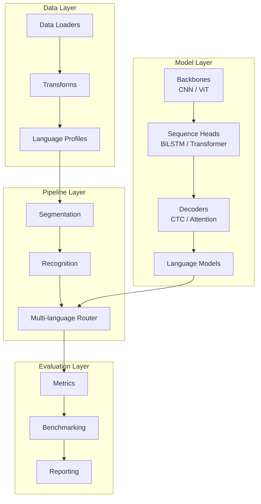
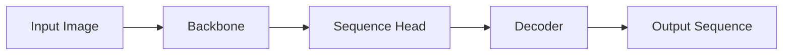
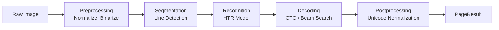

# Architecture Overview

Thulium is designed as a modular, extensible library for handwritten text recognition (HTR). The architecture separates concerns into well-defined layers, enabling researchers and engineers to customize individual components while maintaining system coherence.

## System Architecture



---

## 1. Data Layer (`thulium.data`)

The data layer handles all input processing and language-specific configuration.

### Components

| Component | Module | Description |
| :--- | :--- | :--- |
| **Loaders** | `loaders.py` | Ingest images (PNG, JPEG) and PDFs via `pdf2image` |
| **Transforms** | `transforms.py` | Resize, pad, normalize, and augment images for model input |
| **Language Profiles** | `language_profiles.py` | Central registry of alphabets, tokenizers, and decoder configs for 50+ languages |

### Language Profile Schema

Each language profile encapsulates:

- **Character Set**: Complete alphabet including script-specific characters
- **Script Type**: Latin, Cyrillic, Arabic, Devanagari, Georgian, Armenian, etc.
- **Directionality**: LTR (left-to-right) or RTL (right-to-left)
- **Tokenization Strategy**: Character-level, BPE, or word-level
- **Decoder Configuration**: Default decoder type and language model linkage

---

## 2. Model Layer (`thulium.models`)

PyTorch-based implementations of neural network components for sequence modeling.

### Model Component Hierarchy



### Component Variants

| Component | Type | Description |
| :--- | :--- | :--- |
| **Backbone** | CNN (ResNet) | Convolutional feature extraction |
| **Backbone** | ViT | Vision Transformer for global attention |
| **Sequence Head** | BiLSTM | Bidirectional recurrent modeling |
| **Sequence Head** | Transformer | Self-attention sequence modeling |
| **Decoder** | CTC | Connectionist Temporal Classification |
| **Decoder** | Attention | Autoregressive sequence decoding |

### CTC Loss Function

The Connectionist Temporal Classification (CTC) loss enables alignment-free training:

```
L_CTC = -ln p(y | x)
```

Where `p(y | x)` marginalizes over all valid alignments between the input sequence `x` and target sequence `y`. The CTC algorithm uses dynamic programming to efficiently compute the sum over exponentially many paths.

---

## 3. Pipeline Layer (`thulium.pipeline`)

Orchestrates the complete workflow from raw input to structured output.

### Pipeline Flow



### Pipeline Types

| Pipeline | Module | Purpose |
| :--- | :--- | :--- |
| **HTR Pipeline** | `htr_pipeline.py` | Core handwriting recognition |
| **Segmentation Pipeline** | `segmentation_pipeline.py` | Layout analysis and line extraction |
| **Form Pipeline** | `form_pipeline.py` | Structured form processing |
| **Multi-language Pipeline** | `multi_language_pipeline.py` | Language detection and routing |

### Configuration System

Pipelines are configured via YAML files supporting:

- Model architecture selection
- Preprocessing parameters
- Decoder settings
- Language profile references

---

## 4. API Layer (`thulium.api`)

Exposes high-level functionality for end-users.

### Public Functions

| Function | Description |
| :--- | :--- |
| `recognize_image()` | Recognize text in a single image |
| `recognize_pdf()` | Process all pages of a PDF document |
| `recognize_batch()` | Batch processing for multiple images |

### Return Types

- **PageResult**: Container for recognized text, line objects, confidence scores, and metadata
- **Line**: Individual text line with bounding box and confidence

---

## 5. Evaluation Layer (`thulium.evaluation`)

Tools for assessing and comparing model performance.

### Metrics

**Character Error Rate (CER)**:

```
CER = (S + D + I) / N
```

Where:
- S = Number of character substitutions
- D = Number of character deletions
- I = Number of character insertions
- N = Total characters in reference

**Word Error Rate (WER)**:

```
WER = (S_w + D_w + I_w) / N_w
```

Applied at the word level rather than character level.

**Sequence Error Rate (SER)**:

```
SER = 1 if reference != hypothesis else 0
```

Binary indicator of exact match.

### Benchmarking

The benchmarking module supports:

- Dataset-level evaluation
- Cross-language comparison
- Model variant comparison
- Latency profiling

---

## 6. Explainability Layer (`thulium.xai`)

Tools for understanding model behavior and debugging recognition errors.

### Components

| Component | Module | Description |
| :--- | :--- | :--- |
| **Attention Maps** | `attention_maps.py` | Visualize model attention patterns |
| **Confidence Analysis** | `confidence_analysis.py` | Analyze per-character confidence scores |
| **Error Analysis** | `error_analysis.py` | Categorize and diagnose recognition errors |

---

## Design Principles

1. **Modularity**: Each component can be replaced or extended independently
2. **Configurability**: YAML-based configuration for reproducibility
3. **Type Safety**: Comprehensive type hints throughout the codebase
4. **Testability**: Designed for unit and integration testing
5. **Language Extensibility**: Adding new languages requires only profile definition
